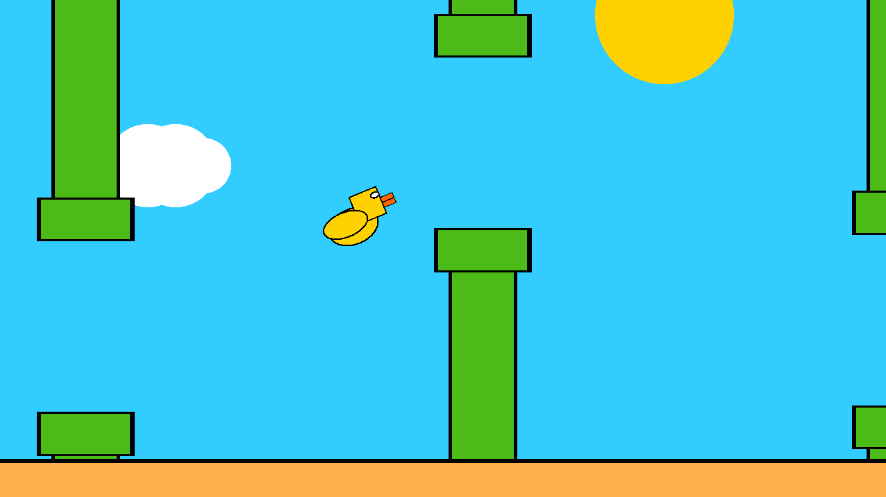
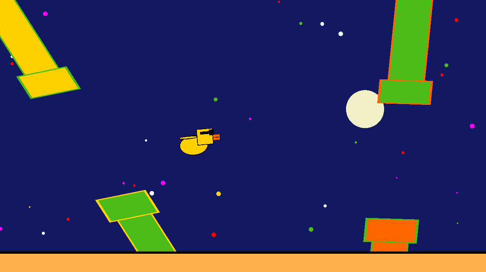
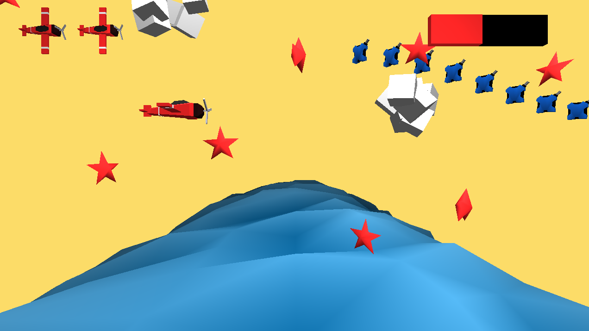
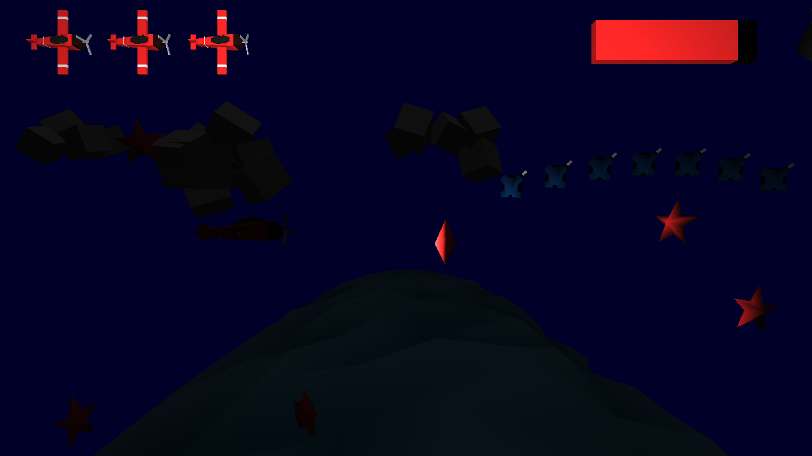
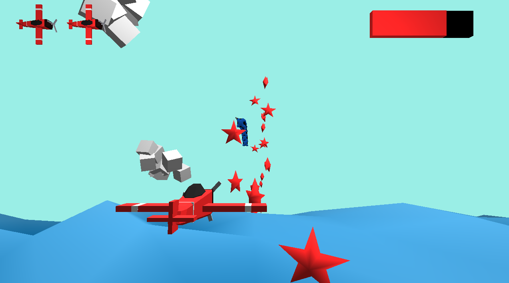
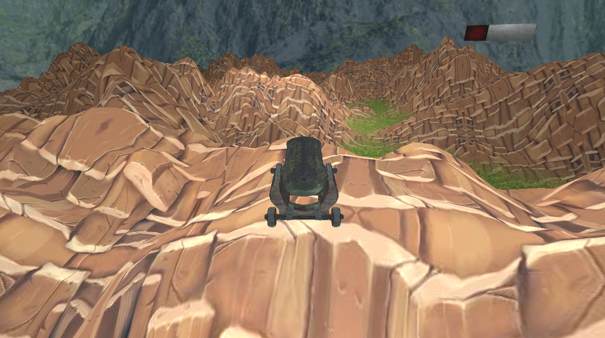
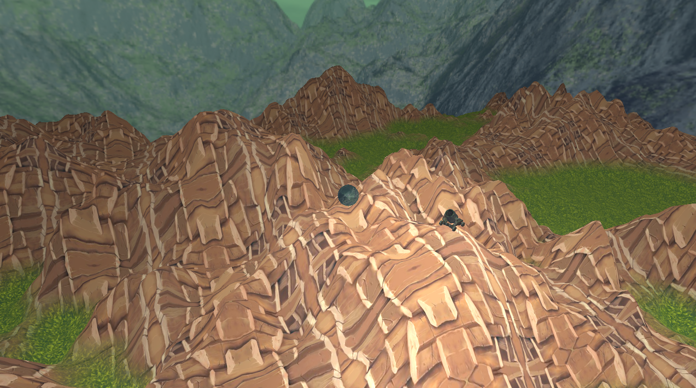
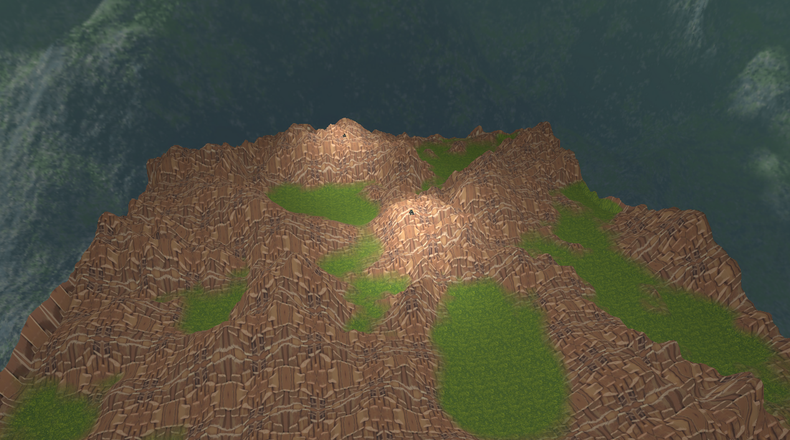

# Video-Games
This repository contains 3 games developed by me in C++ using OpenGL as university projects.
The framework I used to build the games is provided by my University.

## Game1: Gangster Bird  
Location: Tema1/ 

This is a copy of Flappy Bird, with 2 playing modes: classic mode(very similar to Flappy Bird) and gangster mode (the pillars are inclined, they move back and forth and change colors).    

## Game2: Aviator  
Location: Tema2/  
This game is an endless runner. You lose either by colliding 3 times with the red stars or by not keeping your fuel above 0.
The game cycles between night and day.    

  

  

## Game3: Cannons  
Location: Tema3/  
Two cannons are spawned on a map generated using a heightmap. They take turns in lunching cannonballs at eachother.
When a cannonball hits the ground it will deform it.    

  

  
